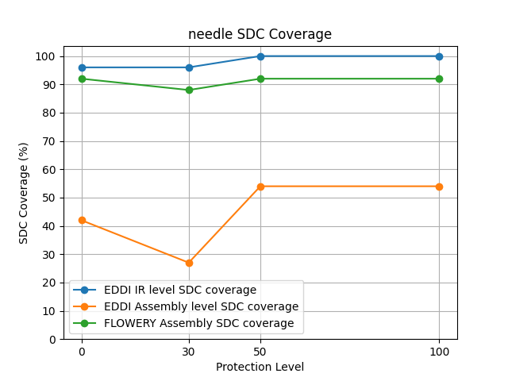

## Quick Plot
This folder contains all data generated from extensive fault injection experiments, of which results are summarized in ```.txt``` files and can be drawn by Python scripts (Python>=3 && Matplotlib).
Matplotlib library can be installed by ```pip install matplotlib```.
You can generate the figures for each benchmark via following commands:
```shell
python3 generatePlot.py
```
After that, you will see each benchmark generating a figure called ```BMNAME_fig.png``` (e.g. ```needle_fig.png``` for needle benchmark as example below).
There are 3 lines for in each figure: 
- **EDDI IR Level SDC Coverage**
- **EDDI Assembly Level SDC Coverage**
- **FLOWERY Assembly SDC Coverage**.



**EDDI IR Level SDC Coverage** and **EDDI Assembly Level SDC Coverage** can be checked in Figure2 in original paper, which shows a gap in EDDI (baseline) for cross-layer SDC protection.

**FLOWERY Assembly SDC Coverage** can be checked in Figure17 (golden line) in original paper, which shows how FLOWERY (our proposed method) can eliminate the gap.

Note that we avoid extensive fault injection time (since it requires enviornmental configurations and millions of program execution) and directly collect the results in ```.txt``` file, those results can be obtained in ```SC23-FLOWERY/AD-AE-evaluation/s5-cross-layer-evaluation``` and ```SC23-FLOWERY/AD-AE-evaluation/s7-evaluation```
folders.
<!-- After running this script, each benchmark will generate their own result figure called benchmark_graph.png. You can directly compare this figure with figure 17. If you want to know more detailed process, you can go to s5-cross-layer-evaluation and s7-evaluation section to run each sub script. The detailed steps can be found in Reproducing Paper Results section of README.md. Remember that to use our prepared reproducing python scripts, you may have to use the benchmark-name (in code) instead of that in the original paper. This also can be found in Benchmark Info section of README.md. -->